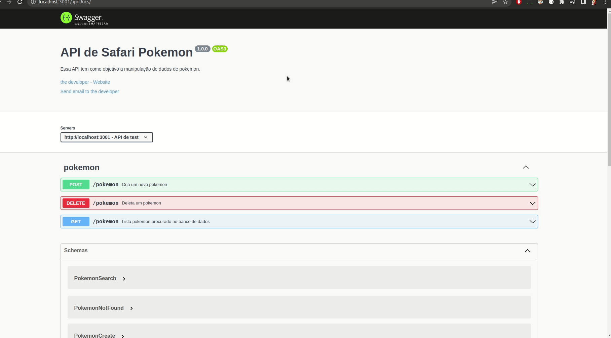

<br>
<hr>

<h4 align="center"> 
	🚧   Safari Pokemon 🚀 Finalizado  🚧
</h4>


<br>
<h2>Sobre</h2>
<p align="justify"> Safari Pokemon é uma aplicação web FullStack, onde você pode adicionar
                    e remover Pokemon no safari e captura-los.</p 

### Features

-  Adicionar e remover pokemon no banco de dados
-  Sistema de capturar pokemon
-  Lista de Pokemon capturados fica salva no navegador

<br>
## 🛠 Tecnologias

As seguintes ferramentas foram utilizadas na construção do projeto:

- [Docker](https://www.docker.com/)
- [Swagger](https://swagger.io/)
- [swagger-ui-express](https://www.npmjs.com/package/swagger-ui-express)
- [JavaScript](https://developer.mozilla.org/en-US/docs/Web/JavaScript/Language_Resources)
- [expressJs](https://expressjs.com/pt-br/)
- [Node.js](https://nodejs.org/en/)
- [React](https://pt-br.reactjs.org/)
- [Jest](https://jestjs.io/pt-BR/)
- [RTL](https://testing-library.com/)
- [Frisby](http://frisbyjs.com/)
- [Mocha](https://mochajs.org/)
- [Chai](https://www.chaijs.com/)
- [Sinon](https://sinonjs.org/)
- [React-Router-Dom](https://www.npmjs.com/package/react-router-dom)
- [BootStrap](https://getbootstrap.com.br/)
- [Sequelize](https://sequelize.org/)
- [Dotenv](https://www.npmjs.com/package/dotenv)
- [Joi](https://joi.dev/)
- [Mysql2](https://www.npmjs.com/package/mysql2)
- [Nodemon](https://www.npmjs.com/package/nodemon)


<br>
<h2>Instalar o projeto em sua máquina</h2>
<br>
<h3>Pré-requisitos</h3>

Antes de começar, você vai precisar ter instalado em sua máquina as seguintes ferramentas:
[Git](https://git-scm.com), [Docker](https://www.docker.com/) e [Docker-Compose](https://docs.docker.com/compose/install/).

<br>

### Certifique-se que as portas 3000 e 3001 não estão sendo utilizadas. [Liberar portas](https://stackoverflow.com/questions/14790910/stop-all-instances-of-node-js-server).

<br>

###  Rodando a aplicação .

```bash
# Clone este repositório

# Foi utilizado SSH
$ git clone https://github.com/MarcoMecenasFilho/safaripokemon

# Acesse a pasta do projeto no seu terminal/cmd
$ cd safaripokemon

# Rode o docker-compose

$ docker-compose up

```
<br>

### Abra seu navegar e coloque o endereço http://localhost:3000/

<br>


<br>

## Para acessar a documentação da API, basta acessar o endereço http://localhost:3001/api-docs

<br>



<br>

### Depois de utilizar a aplicação não se esqueça de rodar o comando docker-compose down no terminal, dentro da pasta raiz do projeto.

<br>

### Rodando os testes.

Antes de iniciar os testes, lembre de usar o comando docker-compose up no terminal, na raiz do projeto. Caso não tenha utilizado ele anteriormente.

#### Testes Frontend

```bash

# Acesse a pasta client a partir da raiz do projeto
$ cd client

# Instale as dependências

$ npm install

# Rode os testes

$ npm test
```

#### Testes Backend
Antes de iniciar os testes, lembre de usar o comando docker-compose up no terminal, na raiz do projeto. Caso não tenha utilizado ele anteriormente.

```bash

# Acesse a pasta server a partir da raiz do projeto
$ cd server

# Instale as dependências para poder rodar os testes unitários

$ npm install

# Rode os testes

$ npm test

```

## Utilizando a aplicação
<hr>

Para capturarmos um Pokemon, utilizamos o forms superior. Caso este pokemon esteja no safari (banco de dados) ele será capturado e um card com suas informações é mostrado na área de Pokemon capturados. Caso ele não esteja no safari. Uma mensagem ira dizer que não pode encontra-lo 


<br>

Para adicionar um Pokemon ao safari(Banco de dados), clicamos no botão e um form será aberto. Adicione as informações necessárias (Para imagens de boa qualidade sugiro o site oficial [Pokemon](https://www.pokemon.com/br/pokedex/), basta copiar o endereço da imagem). Assim o pokemon foi adicionado ao safari e assim sendo possível captura-lo.


<br>

É possível criar Pokemon customizados, como transformar você em um Pokemon. Basta adicionar suas informações e o endereço de uma imagem sua.


<br>

 Caso o nome ou o id do Pokemon já esteja sendo utilizado, uma mensagem irá aparecer.

 

 <br>

 Para retirar um Pokemon do safari(banco de dados). Basta clicar no botão e um forms irá aparecer, coloque o nome que deseja. Caso o pokemon exista ou não. Uma mensagem específica será mostrada.

 

 <br>


 Quando Capturamos um pokemon, ele é mostrado ná área de captura. Não é possível capturar Pokemon repetidos. Quando você o captura, mesmo que o nome seja retirado do safari (Banco de dados), ele ainda continuará com você (Fica salvo no LocalStore do seu navegador). Para libertar o Pokemon, basta clicar no botão dentro do card daquele Pokemon.

 

<br>

### Depois de finalizar os testes e/ou utilizar a aplicação. Lembre-se de utilizar o comando docker-compose down na pastas raiz do projeto. 

<br>

## Este projeto foi feito com muita dedicação e carinho por Marco Mecenas. [Entre em contato!](https://www.linkedin.com/in/marcomecenasfilho/).

<br>

## Gostou do projeto ? Visite meu [Portfólio](https://marcomecenasfilho.vercel.app/) para visualizar outros trabalhos.
